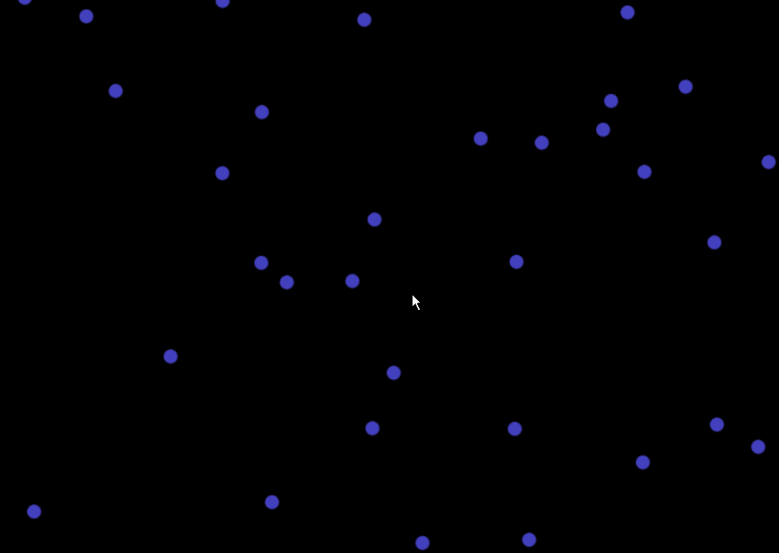

# Lab 5 for CMPM 163
Introduction to particles.

I have chosen to do Part 2.

Google Drive link to videos:
https://drive.google.com/open?id=1KoMqn7huD2G8fPlzVlVvJx87G9U4mgZH

## Writeup  

Custom particle description:
I implemented a mock gravity system, where particles are orbiting around the central point as they gravitate towards it while still having some velocity outwards. It does not perfectly mimic true gravitational behavior, but it can be seen that when each particle finds their orbit, they do not stray too far from their path any longer. With 1000 particle samples, you can see the circular paths in both the x and y axis.

