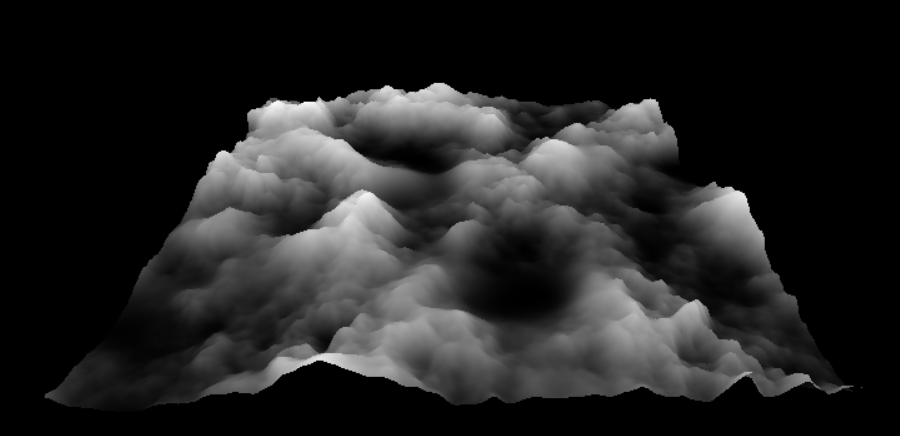
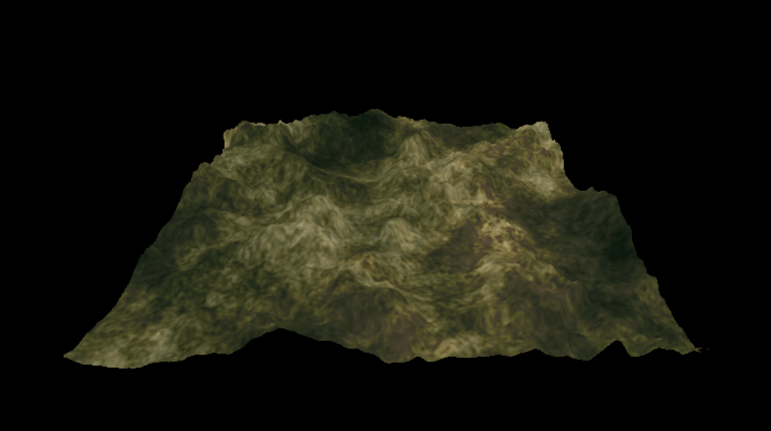
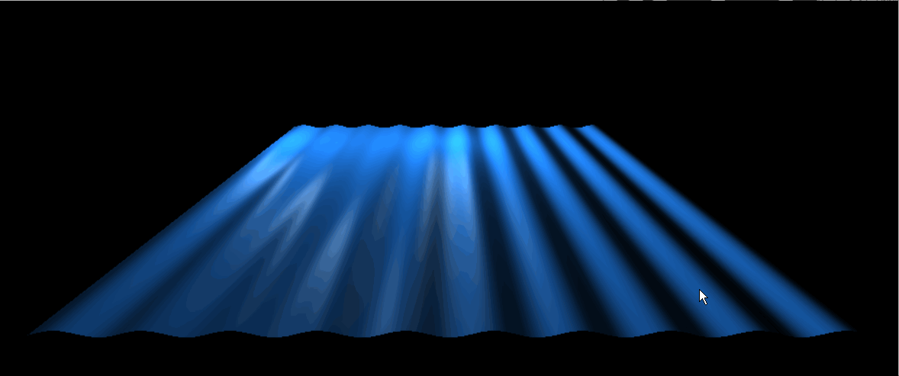

# Lab 7 for CMPM 163
Mesh Manipulation in Three.js.

Three.js (Part 2) was the selected assignment.

Google Drive Video Links:  
Part B: https://drive.google.com/open?id=1ybPIvFtC1AuYdgvu7EksAvV0ol32tWEx  
Part C: https://drive.google.com/open?id=1yO3RLZxk8LRHdKbADPJ_gPCit6Aed9Ke

## Writeup  

Partner: Gangjun Ha

1) Which part did they do?  
A: I did the part 1 Unity project.  
2) Which part of a tutorial did your partner find most challenging?  
A: The hardest part of the tutorial was understanding each nodes and how to connect each of them in unity. Because Unity is more visual based, I had to learn which function does what by knowing each given function, not like coding each function to do something.  
3) Which part of a tutorial did your partner find most interesting?  
A: I found seeing the result directly in the world space most amusing. I have used Unity when I made a VR game but I never knew about these shader graphs. I always liked Unity because I can see what I actually made through coding straight-forward.  
4) Note whether or not you or your partner helped each other with any part of the lab.  It’s completely fine if you didn’t.  
A: We did not ask for help.  

