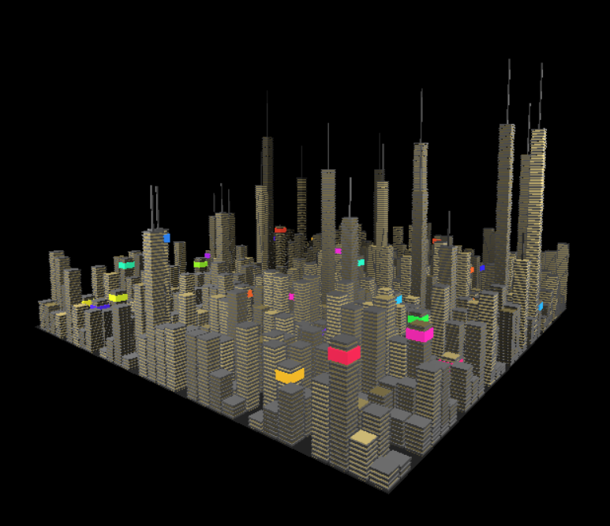

# Lab 8 for CMPM 163
Procedural Generation.

Three.js (Part 2) was the selected assignment.

Inspired Image:  

Created Generative City:  

## Description:  
I was inspired by the prominent lights in a night city view, mainly comprised of yellow lights from inside of rooms sporadically across the buildings.  
Taller buildings are also given a pointy tip and are significantly taller than the others as seen in the inspirational image where the taller buildings are a good amount taller than their shorter brethren.  
Several buildings are also given neon signs of varying colors.  
The city is also sectioned into blocks with roads inbetween, as a standard city layout is.

## Partner Writeup:  
This week, my partner was unable to provide answers as they were occupied with personal issues.
